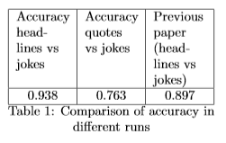
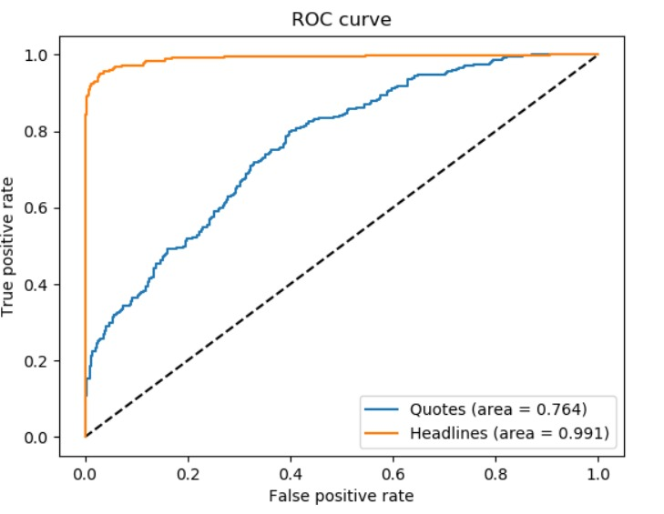

## Goal and Initial Idea

Upon reading previous papers it came to our notice that previous humour recognition papers are based on a comparison between jokes and news headlines. The results attained with those papers are questionable since news headlines do not represent spoken everyday language (such as used in most jokes). We propose that the major differences in the domain of the datasets may cause a systematic error in the experiment. In order to investigate this, we will run an experiment using a convolutional neural network using a negative dataset of news headlines and a different dataset of quotes or rather proverbs/sayings, which usually contain more common language. 

## Dataset information

In order to test whether the network can distinguish between humorous and non-humorous sentences we need a positive (contains humour) and a negative dataset (does not contain humour). In our experiment we used 3 different datasets, for our positive data we used the short jokes dataset available via Kaggle which was also used previously by Chen and Soo. As for the negative datasets, we used the 'a million headlines' dataset and the 'quotes' dataset.
Both negative datasets were compared to the jokes dataset separately in order to find whether there is a difference in how challenging the classification task is for the network. This can be done because the 'a million headlines' dataset consists of only news headlines.

## Network

A convolutional network was created using Keras and Tensorflow. It consists of 7 layers as shown in the source code below.

```markdown

# Network Architecture:

model = keras.Sequential([
   keras.layers.Conv1D(filters,
                       kernel_size=(3),
                       activation='relu'),
   keras.layers.MaxPool1D((2)),
   keras.layers.Dropout(0.25),
   keras.layers.Flatten(),
   keras.layers.Dense(128, activation='relu'),
   keras.layers.Dropout(0.5),
   keras.layers.Dense(2, activation='softmax')
])

```
The network is trained using the Adam optimizer and the Categorical Cross Entropy loss function

## Results
In this section, we will showcase the outputs of our network and its performance compared to the paper by Chen and Soo. In table 1 we can clearly see the difference in performances of the 2 different datasets and also compared to the previous research. One should note that our better results using the headline dataset might be due to a less rigorous headline selection so this does not mean our network is necessarily better. But the goal of this experiment was not to improve on the network as much as it was to investigate the effect of the dataset on the network performance.



One should also note that all the graphs and results were computed using test data and should therefore not show inflated accuracy because of over-training.



Furthermore, Figure 1 shows how the performance of the network differs depending on what dataset is used for the negatives, confirming our hypothesis. It clearly shows that the classification between jokes and headlines is a much easier task, featuring an AUC (Area Under the Curve) of 0.991, whereas the classification between jokes and quotes only yields an AUC of 0.764. This proves the initial assumption that the experiments in previous papers contain a systematic error through the choice of datasets. The high accuracies found by previous papers (ca. 83\%) is probably achieved because news headlines have very obvious identifying features (rare words, more condensed language, less colloquial terms etc.). We assume that our accuracy of 93.8\% is due to a smaller size of the training and test datasets as well as a more complex network. 


The findings of Figure 1 and Table 1 are also supported by Figure 2 and Figure 3. Figure 2 (jokes vs headlines) shows a nearly ideal histogram with barely any overlap in between the classes. Figure 3 (jokes vs quotes) shows a significant overlap of the classes, indicating more false predictions. Additionally, the typical peaks at 0 and 1 are far less pronounced, implying a more difficult classification task. Both histograms indicate that the respective networks hold predictive power.


## Discussion

Our results showcase that there is a clear difference in performances depending on which dataset you use and from which domain it is. Chen and Soo obtained extremely good results using CNNs on their datasets because of the domains between positive and negative set were very different. This, of course, doesn’t change the fact that their model is an improvement on the state of the art, as most previous studies used the same or similar datasets. Our results suggest a change of focus of negative datasets used in creating humour detection networks, towards a more diverse range of negative examples. Such that multiple non-humorous domains can be taken into consideration, making future models more diverse. 


### Contact

This project is developed by Szymon Fonau [@Sarkosos](https://github.com/Sarkosos) and Felix Quinque [@Hollyqui](https://github.com/Hollyqui) as a project for [Maastricht University](maastrichtuniversity.nl)(supervised by Jerry Spanakis). If you have any questions about the project you can contact us via:
s.fonau@student.maastrichtuniversity.nl
f.quinque@student.maastrichtuniversity.nl

For further information you can read our [paper](Joke_Recognition_using_CNNs.pdf)
